<div align="center">

#  DealMemory

### **Your sales team's memory, built into every deal**

**DealMemory is an AI deal-intelligence agent that uses persistent memory to remember past deal experiences, learn from outcomes, and provide better-informed recommendations for future deals.**

[](https://www.python.org/)
[](https://streamlit.io/)
[](https://groq.com/)
[](https://hindsight.vectorize.io/)

**Sales & Revenue → Deal Intelligence**

</div>

---

## Project at a Glance

|                        |                                                                                             |
| ---------------------- | ------------------------------------------------------------------------------------------- |
| **Domain**             | **Sales & Revenue**                                                                         |
| **Problem**            | Sales knowledge from previous deal interactions becomes scattered and difficult to reuse.   |
| **Solution**           | DealMemory uses Hindsight to retain, recall, and reason over deal experiences and outcomes. |
| **How**                | **Interaction → Retain → Recall → Recommend → Outcome → Retain → Reflect → Improve**        |
| **Key Differentiator** | **Memory ON vs. Memory OFF** visibly demonstrates the value of persistent learning.         |

---

## What is DealMemory?

Sales teams accumulate valuable knowledge throughout their deals:

* Customer objections
* Competitors mentioned
* Stakeholder concerns
* Pricing discussions
* Commitments and follow-ups
* Responses that worked
* Responses that failed
* Final deal outcomes

This knowledge can become scattered across individual interactions and deal histories.

A conventional AI assistant can summarize the current conversation, but it does not continuously build an evolving memory of what happened in previous deals, what was tried, and what ultimately worked or failed.

**DealMemory changes that.**

It uses **Hindsight** as a persistent memory layer so the agent can:

> **Remember → Recall → Reason → Recommend → Learn**

Instead of starting every deal from zero, DealMemory uses relevant past experiences to help inform the next decision.

---

## The Problem

Every sales interaction can reveal something important.

A prospect might say:

> "Your pricing is too high."

Another might say:

> "We are also evaluating Competitor X."

A technical stakeholder might raise a security concern.

Another customer might respond positively to an ROI-based explanation.

These experiences are valuable because they can influence future deals.

However, the knowledge from previous interactions can become difficult to reuse systematically.

A normal AI assistant can analyze the current conversation, but without persistent memory it does not naturally know:

* What happened in similar previous deals?
* Which objections appeared before?
* Which approaches were attempted?
* Which approaches failed?
* Which approaches succeeded?
* What did the team learn from those outcomes?

### The result

Sales teams can repeatedly encounter similar situations without effectively reusing their accumulated experience.

---

## The Solution

### DealMemory — Persistent Deal Intelligence

DealMemory adds a persistent memory layer to an AI sales agent using **Hindsight**.

Instead of treating every deal as a completely new interaction, DealMemory builds an evolving history of sales experiences and outcomes.

It can:

#### Remember

Retain important deal information such as:

* objections
* competitors
* stakeholders
* pricing discussions
* commitments
* tactics
* customer reactions
* outcomes

#### Recall

Retrieve relevant historical deals before a new interaction.

#### Recommend

Combine the current deal context with relevant historical evidence to provide a better-informed recommendation.

#### Reflect

Reason across multiple previous deals to identify useful patterns.

#### Improve

Retain the outcome and lessons from the current deal so future recommendations can use that new experience.

---

## Why DealMemory?

Traditional sales tools preserve information.

DealMemory focuses on **reusing experience**.

Instead of only asking:

> "What happened in this deal?"

DealMemory asks:

> **"What happened in similar deals, what worked, what failed, and what should we consider this time?"**

---

## The Core Idea

```text
                    NEW DEAL
                       │
                       ▼
              ┌─────────────────┐
              │ Current Context │
              └────────┬────────┘
                       │
                       ▼
                HINDSIGHT RECALL
                       │
          ┌────────────┼────────────┐
          ▼            ▼            ▼
       Deal A       Deal B       Deal C
        LOST          WON        STALLED
          │            │            │
          └────────────┼────────────┘
                       ▼
                HINDSIGHT REFLECT
                       │
                       ▼
              AI RECOMMENDATION
                       │
                       ▼
                  DEAL OUTCOME
                       │
                       ▼
                HINDSIGHT RETAIN
                       │
                       ▼
              BETTER FUTURE DEALS
```

---

## The Key Differentiator

### Memory OFF vs. Memory ON

DealMemory includes a direct memory comparison so the value of persistent learning can be seen during the demo.

### Memory OFF

```text
New Deal
   ↓
Current Context Only
   ↓
LLM
   ↓
Generic Recommendation
```

The agent has no historical deal experience available.

---

### Memory ON

```text
New Deal
   ↓
Current Context
      +
Historical Deal Experiences
      ↓
Hindsight Recall
      ↓
Previous Outcomes
      ↓
Hindsight Reflect
      ↓
Evidence-Informed Recommendation
```

The same scenario can now be interpreted using relevant historical experience.

#### Why this matters

The difference between the two modes makes the role of Hindsight visible:

> **Without memory → generic advice**

> **With memory → experience-informed advice**

---

## The A → B → C Demo

The central demonstration uses three similar deals.

### Deal A — Lost

#### Pricing Objection

```text
Situation:
Prospect objects to pricing.

Approach:
Discount-first.

Outcome:
LOST
```

---

### Deal B — Won

#### Similar Pricing Objection

```text
Situation:
Similar prospect raises a pricing objection.

Approach:
ROI-first + technical proof.

Outcome:
WON
```

---

### Deal C — New Deal

A new prospect raises a similar pricing objection.

#### Memory OFF

The agent might respond with generic advice such as:

> "Consider highlighting product value, discussing ROI, or exploring pricing flexibility."

---

#### Memory ON

DealMemory recalls:

```text
D-001
Discount-first → LOST

D-002
ROI-first + technical proof → WON
```

The agent can then use those historical outcomes when producing its recommendation.

#### The important difference

DealMemory is not simply saying:

> **"I remember Deal A."**

It is using:

> **what happened + what was tried + what happened next**

to inform the current situation.

---

## Why Hindsight?

Hindsight is the **persistent memory layer** of DealMemory.

It is not simply used to store conversation history.

The system uses memory to connect:

**past experience → present context → future decisions**

| Hindsight Operation | DealMemory Purpose                            |
| ------------------- | --------------------------------------------- |
| **Retain**          | Store important deal experiences and outcomes |
| **Recall**          | Retrieve relevant historical deal context     |
| **Reflect**         | Reason across multiple deal experiences       |
| **Retain Again**    | Store the latest outcome and feedback         |

This makes persistent memory a core part of the product rather than an additional feature.

---

## The Learning Loop

```text
Retain → Recall → Recommend → Outcome → Retain → Reflect
```

A completed deal becomes another experience that can inform future deals.

---

## Hindsight Integration

### Retain

```python
hindsight.retain(
    bank_id="dealmemory",
    content=deal_experience,
)
```

### Recall

```python
memories = hindsight.recall(
    bank_id="dealmemory",
    query=current_deal_context,
)
```

### Reflect

```python
insight = hindsight.reflect(
    bank_id="dealmemory",
    query="What approaches worked in similar deals?",
)
```

---

## Architecture

```mermaid
flowchart TD
    A[Sales Interaction] --> B[DealMemory Agent]

    B --> C[Current Deal Context]
    B --> D[Hindsight Memory]
    B --> E[Groq LLM]

    D --> D1[Retain]
    D --> D2[Recall]
    D --> D3[Reflect]

    C --> E
    D2 --> E
    D3 --> E

    E --> F[Deal Brief / Recommendation]
    F --> G[Salesperson Decision]
    G --> H[Deal Outcome]

    H --> D1
    D1 --> D
```



---

## System Components

### 1. Streamlit Interface

The interface provides:

* Deal input
* Memory ON/OFF toggle
* Historical memory display
* Evidence from previous deals
* AI recommendation
* Outcome recording

---

### 2. DealMemory Agent

The agent handles:

* Current deal analysis
* Memory retrieval
* Historical comparison
* Recommendation generation
* Outcome processing
* Memory updates

---

### 3. Hindsight

Hindsight provides persistent memory through:

```text
RETAIN
RECALL
REFLECT
```

It allows the system to build and use knowledge across multiple deal interactions.

---

### 4. Groq LLM

The LLM provides:

* Deal analysis
* Contextual reasoning
* Recommendation generation
* Cross-deal interpretation

---

## Seed Dataset

DealMemory includes **25 synthetic B2B deals** designed for reproducible testing and demonstration.

The dataset is organized into five scenario families:

| Scenario Family                | Purpose                                          |
| ------------------------------ | ------------------------------------------------ |
| **Pricing Objections**         | Compare different approaches to pricing pressure |
| **Competitor Displacement**    | Learn from competitive situations and outcomes   |
| **Stakeholder Changes**        | Track changing decision-maker concerns           |
| **Security / Compliance**      | Learn from blockers and successful responses     |
| **Implementation Risk**        | Learn from adoption and implementation concerns  |

The dataset intentionally contains **similar situations with different outcomes**.

This helps demonstrate that the agent must distinguish between:

> **"These deals look similar."**

and:

> **"These deals look similar, but the successful approach was different."**

---

## Evaluation

DealMemory is evaluated using the same deal scenario with memory disabled and enabled.

| Mode | Available Context | Expected Behavior |
|---|---|---|
| Memory OFF | Current deal only | Generic recommendation |
| Memory ON | Current deal + historical experience | Evidence-informed recommendation |

The evaluation focuses on whether the agent can:

- retrieve relevant historical deals
- use previous outcomes
- distinguish similar situations
- incorporate newly retained experience

---

## Deal Memory Structure

A stored deal experience can contain:

```text
Deal ID
Prospect Context
Industry / Segment
Stakeholders
Objections
Competitors
Pricing Discussion
Commitments
Actions Taken
Sales Response
Customer Reaction
Deal Status
Final Outcome
Successful Tactics
Failed Tactics
Lessons Learned
```

The goal is to preserve both **deal context** and **deal outcome**.

---

## Technology Stack

| Layer                 | Technology                   |
| --------------------- | ---------------------------- |
| **Interface**         | Streamlit                    |
| **Language**          | Python                       |
| **LLM**               | Groq                         |
| **Recommended Model** | `qwen/qwen3-32b`             |
| **Persistent Memory** | Hindsight                    |
| **Dataset**           | Synthetic B2B Deal Histories |

---

## Project Structure

```text
dealmemory-agent/
│
├── README.md
├── LICENSE
├── requirements.txt
├── .env.example
├── .gitignore
│
├── app/
│   └── streamlit_app.py
│
├── agent/
│   ├── agent.py
│   ├── hindsight_client.py
│   └── prompts.py
│
├── data/
│   └── deals_seed_dataset.json
│
├── scripts/
│   └── seed_bank.py
│
├── docs/
│   ├── BUILD_BLUEPRINT.md
│   └── screenshots/
│
├── demo/
│   └── demo-script.md
│
└── tests/
```

---

## Run Locally

### Prerequisites

Before running DealMemory, make sure you have:

* Python 3.10+
* Git
* Groq API access
* Hindsight access

---

### 1. Clone the Repository

```bash
git clone https://github.com/Vasi1951/dealmemory-agent.git
cd dealmemory-agent
```

---

### 2. Create a Virtual Environment

#### Windows

```powershell
python -m venv .venv
.venv\Scripts\activate
```

#### macOS / Linux

```bash
python3 -m venv .venv
source .venv/bin/activate
```

---

### 3. Install Dependencies

```bash
pip install -r requirements.txt
```

---

### 4. Configure Environment Variables

Create a local `.env` file using `.env.example`.

```env
GROQ_API_KEY=your_groq_api_key_here
HINDSIGHT_API_KEY=your_hindsight_api_key_here
HINDSIGHT_BASE_URL=your_hindsight_base_url
HINDSIGHT_BANK_ID=dealmemory
```

> **Never commit `.env` or API keys to GitHub.**

---

### 5. Seed the Hindsight Memory

```bash
python scripts/seed_bank.py
```

This loads the historical deal dataset into the Hindsight memory layer.

---

### 6. Start DealMemory

```bash
streamlit run app/streamlit_app.py
```

Open the local Streamlit URL shown in the terminal.

---

## Demo Flow

The recommended demonstration is intentionally simple and focused.

### 01 — Introduce the Problem

> "Sales teams accumulate valuable experience across deals, but that experience is difficult to reuse."

---

### 02 — Memory OFF

Enter the pricing-objection scenario.

Show the generic recommendation produced using only the current deal context.

---

### 03 — Memory ON

Run the same scenario.

Show:

* Relevant historical deals
* Previous approaches
* Previous outcomes
* Historical evidence
* Updated recommendation

---

### 04 — Explain Why

Show why the recalled deals are relevant to the current prospect.

---

### 05 — Record the Outcome

Record the current deal as:

```text
WON
LOST
STALLED
```

---

### 06 — Retain the Experience

Store the new outcome and lesson in Hindsight.

---

### 07 — Demonstrate Future Learning

Use another similar deal and show how the newly retained experience can become part of future reasoning.

---

## Privacy & Data

The included dataset is **synthetic** and intended for development and demonstration.

Do not commit:

* API keys
* passwords
* access tokens
* confidential customer information
* private CRM exports
* production sales data

For a production deployment, additional controls would be required for:

* Authentication
* Authorization
* Tenant isolation
* Encryption
* Audit logging
* Data retention
* Customer-data protection

---

## Limitations

DealMemory does **not** guarantee that a strategy will win a deal.

Historical outcomes are **evidence, not certainty**.

A recommendation can be wrong when:

* the current prospect differs from historical cases,
* historical data is incomplete,
* important factors were not captured,
* or retrieved deals are not genuinely comparable.

DealMemory is designed to **assist the salesperson**, not replace human judgment.

---

## Future Scope

Potential extensions include:

* CRM integrations
* Call-transcript ingestion
* Email and calendar integrations
* Stakeholder relationship graphs
* Organization-specific sales playbooks
* Larger real-world datasets
* Team-level analytics
* Enterprise authentication
* Audit and governance workflows

---

## Team

### Multi Thread

| Name                       | Role        |
| -------------------------- | ----------- |
| **Mamidi Vashisht**        | Team Leader |
| **Ladi Sai Ramana**        | Member      |
| **Indurthi Dinesh Balaji** | Member      |

---

## Resources

* [Hindsight Documentation](https://hindsight.vectorize.io/)
* [Hindsight GitHub Repository](https://github.com/vectorize-io/hindsight)
* [Hindsight Cloud](https://ui.hindsight.vectorize.io/)
* [Groq](https://groq.com/)
* [Streamlit](https://streamlit.io/)

---

## License

This project is licensed under the MIT License — see the [LICENSE](LICENSE) file for details.

---

<div align="center">

** DealMemory**

**Remember the experience.**

**Learn from the outcome.**

**Use it in the next deal.**

</div>
